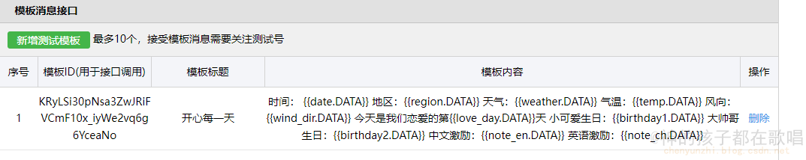
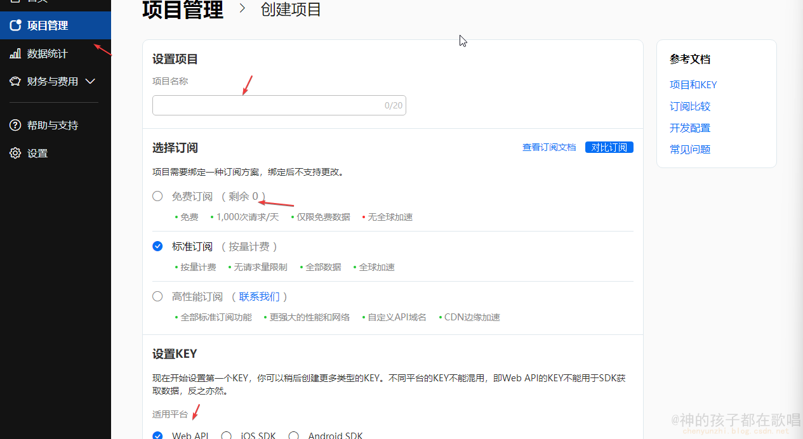
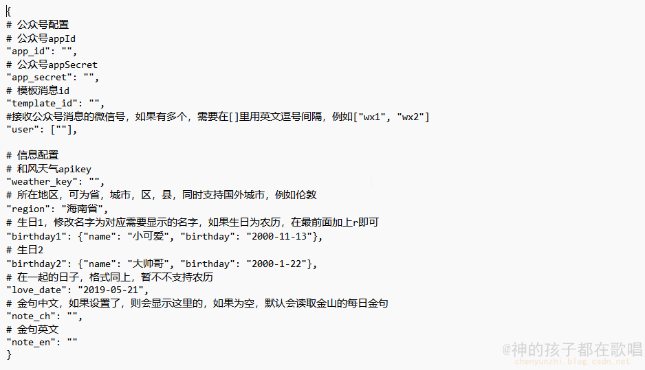
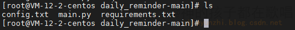
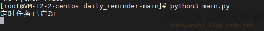

#### 每天定时发送消息给女朋友

参考地址：https://github.com/limoest/daily_reminder


### 一. 环境准备

1. 一个云服务器（腾讯云，阿里云，华为云都可以）

2. 申请公众平台测试账号

   

3. 创建模板

``` css
时间： {{date.DATA}} 
地区：{{region.DATA}} 
天气：{{weather.DATA}} 
气温：{{temp.DATA}} 
风向：{{wind_dir.DATA}} 
今天是我们恋爱的第{{love_day.DATA}}天 
小可爱生日：{{birthday1.DATA}} 
大帅哥生日：{{birthday2.DATA}} 
中文激励：{{note_en.DATA}} 
英语激励：{{note_ch.DATA}}
```



4. 申请和风的key

地址：https://console.qweather.com/#/apps/create-app/create




### 二. 代码拉取和配置

1. 代码地址：https://github.com/Rodma1/wx_daily_reminder
2. 在config.txt文件中配置信息

> app_id，app_secret，template_id，user在微信测试账号中都有




### 三. 项目部署

1. 将你的代码和配置文件放入指定文件夹下

   > 执行 pip3 install -r requirements.txt -i https://pypi.tuna.tsinghua.edu.cn/simple安装依赖



#### 3.1  直接运行


你可以直接python3 main.py运行



#### 3.2 后台运行 

如果你想后台运行，可以使用 `systemctl` 命令来在 Linux 系统上以后台服务的形式运行 Python 脚本。以：

1. 创建一个新的服务文件：在 `/etc/systemd/system/` 目录下创建一个新的服务文件，例如 `daily_reminder.service`。

2. 编辑服务文件：使用文本编辑器打开服务文件，添加以下内容：

   ```shell
   [Unit]
   Description= daily reminder
   After=network.target
   
   [Service]
   ExecStart=/usr/bin/python3 /chenyunzhi/project/weixin/daily_reminder-main/main.py
   WorkingDirectory=/chenyunzhi/project/weixin/daily_reminder-main/
   Restart=always
   
   [Install]
   WantedBy=multi-user.target
   ```

   > 注意: 替换 `ExecStart` 中的 `/usr/bin/python3` 和 `/path/to/main.py` 为你的 Python 解释器路径和脚本路径。确保指定正确的工作目录`WorkingDirectory`。

   

3. 启用和运行服务：运行以下命令以启用和运行服务。

   ```shell
   sudo systemctl daemon-reload
   sudo systemctl enable daily_reminder.service
   sudo systemctl start daily_reminder.service
   ```

   这将重新加载 systemd 守护程序、启用你的服务，并将其启动。

4. 检查服务状态：可以使用以下命令来检查服务的状态和日志。

   ```shell
   sudo systemctl status daily_reminder.service
   sudo journalctl -u daily_reminder.service
   ```

   第一条命令将显示服务的状态信息，包括是否正在运行。第二条命令将显示与服务相关的日志。

> 通过这种方式，你的 Python 脚本将在后台作为一个服务运行，并且会在系统启动时自动启动。你可以使用 `systemctl` 命令来管理服务，例如停止、重启或禁用服务。
>


#### 四. 效果图


